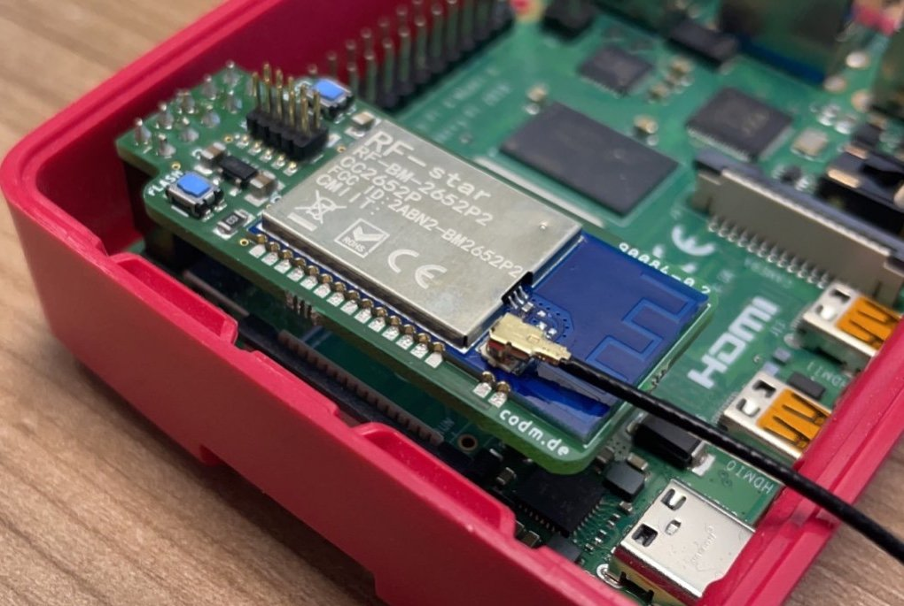

# cod.m ZigBee CC2652P Raspberry Pi module
[ZigBee CC2652 Raspberry Pi Coordinator](https://shop.codm.de/automation/zigbee/33/zigbee-cc2652p2-raspberry-pi-module) - a ZigBee Coordinator designed for the GPIO of the Raspberry Pi running Z-Stack Firmware 3.x - thanks to [Koenkk](https://github.com/Koenkk/).
The used CC2652P is the current generation of microcontrollers for ZigBee 3.x Coordinators and has an integrated power amplifier (+20dBm) for better coverage. 

According to [koenkk](https://github.com/Koenkk/Z-Stack-firmware/tree/master/coordinator) the CC2652 allows for up to 50 direct children and 100/200 routes directly on the coordinator. 
The size of a ZigBee mesh is not defined by the count of possible direct children at the coordinator, see https://www.zigbee2mqtt.io/information/FAQ.html#i-read-that-zigbee2mqtt-has-a-limit-of-20-devices-is-this-true

This module is the successor of our [CC2538 module](https://github.com/codm/cc2538-raspberry-pi-module). This time it is powered via the 5V rail of the Raspberry Pi with an LDO (Low Drop Out) voltage regulator. The CC2538 worked well on 3.3V directly but for the CC2652 we've decided to be not dependent on the internal voltage regulators of the Pi itself. 

You can buy a ready built coordinator, including external antenna at our webshop https://shop.codm.de/automation/zigbee/33/zigbee-cc2652p2-raspberry-pi-module or built on for non commercial use by yourself based on the files in this repository. Use the `bom.ulp` from Eagle to generate a parts list (BOM). 
If you can't get hold of the AP2112K you can also use an TLV75533P.




# Running
To us the module directly on the serial interface on the GPIO of the Raspberry Pi, you have to free it up first. Either completely or by moving the Bluetooth UART to the mini-uart.
See  https://www.raspberrypi.org/documentation/configuration/uart.md for a detailed explanation.

This is also explained in the manual (german): [Anleitung cod.m ZigBee CC2652 Raspberry Pi Modul](https://shop.codm.de/media/pdf/be/b9/21/20210427_ZigBee_CC2652_Raspberry_Pi_Modul_V02_Datenblatt_Anleitung-web.pdf)

## zigbee2mqtt
Edit `data/configuration.yaml` accordingly: 

```
serial:
  port: /dev/ttyAMA0
  advanced: 
    baudrate: 115200 
    rtscts: false
```

## Homegear
Install `homegear-zigbee` and edit `/etc/homegear/families/zigbee.conf`: 

```
[Serial]
id = CC2652 
deviceType = serial

#use your own 16 bytes hexadecimal key! 
password = AABBCCDDEEFF11223344556677889900

device = /dev/ttyAMA0
```
Don't forget to comment in the `[]` block.


# Antenna
We recommend to use only external antennas as the module is close to the WiFi and Bluetooth module/antenna on the Raspberry Pi. But if you want to use the attached PCB antenna, rotate the resistor pointing to the u.FL socket by 90° so it connects the PCB trace.

# Firmware
We use Koenkk's Z-Stack 3.x Coordinator Firmware from https://github.com/Koenkk/Z-Stack-firmware/tree/master/coordinator/Z-Stack_3.x.0/bin, ZigStar Variant as it uses the same RF-BM-2652P2.

You can flash the firmware either by JTAG or directly from the Raspberry Pi using [cc2538-prog](https://github.com/1248/cc2538-prog/) - despite the name it also works with the CC2652.
The firmware has the needed serial bootloader enabled.

## JTAG
The 2x05 header is following the common [JTAG-Cortex-M0](https://www.segger.com/products/debug-probes/j-link/accessories/adapters/9-pin-cortex-m-adapter/) Layout.

Use `CC2652R1F` and `JTAG`@4000kHz.


## Serial via GPIO
Install and compile [cc2538-prog](https://github.com/1248/cc2538-prog/).

While connected and powered through the Pi, hold down the `flash` button on the module and press `reset` shortly while still holding `flash`. The CC2652 should now be in the bootloder.

Then execute `./cc2538-prog -d /dev/ttyAMA0 -f CC1352P2_CC2652P_launchpad_coordinator_20210120.hex `

The output should look like this: 
```
ping ok
Bootloader detected
Erasing page 0
Erasing page 1
[...]
Erasing page 254
Erasing page 255
Writing 16 bytes to 0x00200000
Writing 16 bytes to 0x00200010
[...]
Writing 16 bytes to 0x0023C7F0
Writing 12 bytes to 0x0027FFD4
```

After that reset the module using the corresponding button. 
It happened sometimes that I had to replug the module to get it to work again. 


# Thanks
* @koenkk Z-Stack Firmware - https://github.com/Koenkk/Z-Stack-firmware
* @1248 cc2538-prog - https://github.com/1248/cc2538-prog/

# License
[CC-BY-NC-SA 3.0](https://creativecommons.org/licenses/by-nc-sa/3.0/)

cod.m GmbH, Patrik Mayer, 2021